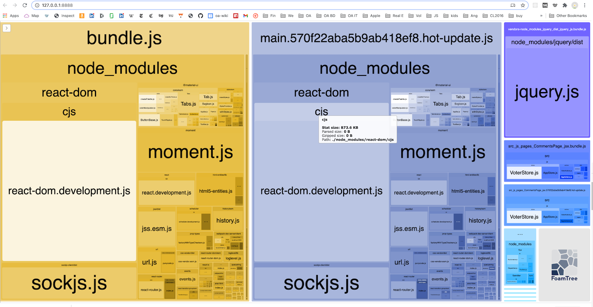

# wevote-landing-page

## New Rules

- **Keep the "index.html" page very simple.** The only resource loaded from the home page should be the favicon.
- **Keep the "Home" page very simple**, so that it gets to LCP (Largest Contentful Paint in (ideally) less than one second). 
- **Keep Stores and Actions pure**.  No calls to other actions or stores from within an action or store.
- **Lazy load all Libraries** except on the "Home" page.  Home page loaded libraries.  If a page is Lazy loaded, any imports are that page will be in the page's bundle. 
- **No copying code**.  Any code copied over from the WebApp should be trimmed down to the least amount of code necessary to 
do what you wanted to, and no more. 
  - If you don't know what it does don't copy it.  Commenting out is ok in the beginning.
  - Not used setters and getters in Stores/Actions are OK.
  - Not used utility functions are OK.
- **Check bundle sizes often**.  The base bundle.js should not "exceed the recommended size limit (244 KiB)."
  - While testing with the Webpack Bundle Analyzer, know that
    - sockjs.js and webpack-dev components are part of dev Webpack and "should not" end up in a production build.
  - Webpack minifies what it can when the cli option  "--mode production" is used, so compile with `npm run start-minified` to minify. 

## Webpack Bundle Analyzer
Set `const isProduction = false;` in webpack.config.js to turn on the analyzer.

## DIY Add-Ons

- [ESLint](https://www.robinwieruch.de/react-eslint-webpack-babel/)

## Installation

- `git clone git@github.com:wevote/wevote-landing-page.git`
- cd wevote-landing-page
- npm install
- npm start
- visit `http://localhost:3000/`
